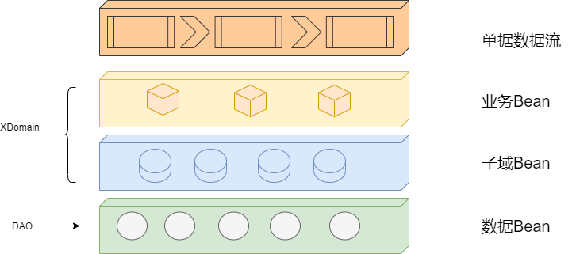

# XDomain UserStory

## XDomain 针对分散在不同业务系统的单据的数据流进行抽象, 并提炼出子领域模型

-   所有子域模型围绕单据进行展开, 所以我们抽象的时候只描述子域模型与单据之间的关系

-   每个子域概念上是正交的, 即理论上子域与子域之间是可以自由组合的
    -   真实世界中组合需要放到具体的场景下才有意义, 也不能随意的组合

## 假设XDomain已经具备了如上的抽象后, 相应的用户故事是,

### 对于单据系统的应用来讲,

-   能够低成本快速扩展出处理不同业务单据的能力
    -   这里低成本指的是能快速的满足业务需求
        -   一种可能的实现方式是通过 "低代码" 来实现
    -   扩展包括两个方面
        -   真实世界中不同的场景下的单据是将XDomain子域进行组合成具体业务模型对外提供出来的
        -   XDomain的子域不可能包含所有真实世界的属性, 即需要非常方便的扩展出新的字段

-   对单据进行统一的管理
    -   统一管理单据的创建, 查询, 状态
    -   单据的变更状态

### 对于XDomain的系统管理员来讲,

-   能够支持低成本的扩展子域的能力
    -   这里的低成本指的是变更 (包含新增?) 一个子域是动态的, 平滑的
        -   动态的意思是, 变更子域应该尽可能的通过配置, 而不应该重新开发
            -   定制的需求可以通过插件加载的方式实现
        -   平滑的指的是,上线后可以无需停机进行更新 ( 待商榷 ?)

-   输出XDomain的产品/技术文档
    -   最终目标XDomain 的一个解决单据业务流程的标准和技术产品, 包含,
        -   如何快速部署一套环境
        -   单据应用怎么快速的接入

# XDomain DesignDraft

## XDomain 的产品架构

### XDomain在具体的业务应用和数据存储之间通过进行分层抽象

1.  **单据数据流** 是外围系统的业务单据流

    -   单据分散在不同的业务系统中

2.  **业务Bean** 是具体业务中特化的领域对象

    -   **业务Bean** 可能会包含一个或者多个子域Bean 对象
    -   **业务Bean** 会有自己的业务属性

3.  **子域Bean** 是XDomain中具体的子域对象

    -   **子域Domain** 概念之间是没有交集的, 即不应该出现同一个概念在两个子域Domain 中都存在
    -   不应该包含业务具体的属性信息

4.  **数据Bean** 是XDomain最终存储在DB中的对象

    -   这里的不特指具体的数据存储类型, 可以是mongo等NoSQL或者MySQL等SQL
    
    -   数据存储承载着来自 **子域Bean** 和 **业务Bean** 的业务特性的要求
        -   版本历史记录

## 应用 与 XDomain 之间的关系

XDomain 将单据存储到了多个子域中, 对外提供接口, 这些接口并不能直接被最上层的应用调用,

-   从技术视角来看, 每个应用处理自己的业务逻辑, 负责整个系统的某个切面

-   从单据的视角来看, 这些应用可看做长在 XDomain 的数据之上的负责具体某个具体事务的应用, 包含,

### 单据导入导出

### 单据对账

  - [单据对账的用户故事](https://wiki.xforceplus.com/display/ECCP/[ECCP][BillChecking]++UserStory)

### 折扣池

# XDomain Structure

## 概述

业务单据各子域从概念上是正交的, 参考[UserStory](https://wiki.xforceplus.com/display/ECCP/[ECCP][XDomain]+UserStory)  
我们没办法一开始想清楚每个子域所有的字段, 或者从业务上讲字段本身就需要有 "柔性"  
但是XDomain的结构是需要被想清楚的, 在结构上存在共同的部分和一些基本原则  

本节描述XDomain的结构  

## XDomain的数据结构

  

当我们在谈论结构的时候, 我们其实是在谈如下三个方面的信息:  

-   XDomain数据组织方式  
    -   XDomain数据结构由头和行两个部分组成  
        -   单据头对应到具体单据的头部信息, 由多个字段组成
        -   单据行对应具体业务单据的明细, 由多个字段组成
    -   总体上头和行字段本身没有强绑定关系, 如果有关系需要持久化这种关系  
        -   子域中存在头是由多个行信息汇总起来的情况
        -   子域中也存在头拆分成多个行的情况

-   XDomina中字段的数据类型  
    -   枚举类型
    -   值类型 (来源于外部系统)  
        -   请注意到底应该是文本还是数值类型

-   一些基本原则  
    -   值允许为空值  
        -   **注意: 这里的空值不是默认值, 表示暂时获取不到值或取不到这个值**
    -   每个字段类型下的值都是一维的  
        -   也就是说字段的值肯定不是多个同类型的值组成
        -   注意: 字段的类型可能是一个字典

各个具体的子域在该数据结构的基础上展开对应各自领域的模型  

## XDomain字段的备份属性

XDomain支持子域数据变更的备份, 在此基础上提供支持历史规矩/ 恢复等能力  
一般来讲实现该能力有两种实现方案  

-   snapshot  
    -   将数据变更之前SNAPSHOT一份, 典型的如对虚拟机进行镜像备份
-   diff  
    -   典型的如git commit

相应的, XDomain针对每个字段可以单独设置备份的属性,  

-   数据域  
    -   当字段的备份属性被设为数据域的时候, 会snapshot方式来进行备份

-   状态域  
    -   当字段的备份属性被设为状态域的时候, 会使用diff的方式进行备份

snaphost实现的成本比较大, 对于变化的字段, 优先考虑做成状态域,  

XDomain的场景下, 有这么一个特性:  

**数据的更新一定引起状态的更新, 但状态的更新不一定需要数据更新**  

所以针对更新比较频繁的字段, 请优先使用状态域, 注意 ****XDomain默认是数据域****  

## XDomain各子域通用的字段

### 单据类型

-   在单据头中应该明确指定具体单据的类型以及单据号

### 前置单据

记录该单据的前置单据, 目前仅支持一种前置单据类型, 但是在一种类型下可以包含多个子单据  

-   真实世界中从别的单据转换过来, 需要记录具体转换规则

### 商品信息

商品/服务类型和数量  

### 金额信息

包含是否含税 (增值税) 的金额  

# XDomain Capacity

## 本节站在技术的视角, 回答XDomain提供哪些能力, 给业务带来那些价值,

-   XDomain可看做业务单据的结构化数据库, 具体业务应用在此数据库之上快速进行组装
-   XDomain理解是一个单据业务消息总线, 外围应用与XDomian完成对接后, 各应用之间的就可以进行协同  
    -   不需要每个应用之间分别定义接口来对齐概念和数据

在实际的项目中, 我们可能还需要不断思索哪些功能或特性是可以下沉到XDomain中来进行提供, 哪些其实是应该在上层中进行组装  

**注意: 这里说的XDomain是一个整体的概念, 包含可能是由低层OQS提供出来的能力**  

## 如下根据接口或者服务的类型可以划分,

-   子域元数据的查询 (数据结构)  
    -   外部系统配置规则等需要获取XDomain的数据结构
    -   原则上XDomain应该提供这类的接口, 但是OQS已经具备了这个能力, 不需重新开发
    -   所以XDomain开放子域元数据查询, 注意 **该接口必须是只读的**

-   数据集的历史记录  
    -   包括版本记录和状态变更记录
    -   直接使用OQS的历史记录功能

-   自定义搜索能力  
    -   子域在定义时标识可搜索字段
    -   业务应用使用OQS的查询DSL进行搜索

-   子域继承  
    -   子域的定义时支持在一个既有的子域的基础上进行继承
    -   继承的能力依托于OQS的限制 (当前只支持5层的继承结构)

-   子域只读的数据查询  
    -   原则上XDomain不应该暴露底层的子域模型, 业务需要查询具体的子域数据, 如果做成聚合对外开发成本和收益不换算, 没有必要
    -   所以XDomain对外提供只读的子域访问能力, **注意: 这里提供子域的数据是只读视图**

-   数据的变更  
    -   所有对子域的修改必须由XDomain提供的接口完成  
        -   即使明确只修改某个具体子域的具体字段
        -   XDomain了解并已知所有对子域的新增/修改路径
    -   XDomain的一次数据变更操作在一个事务内完成
    -   XDomain需要维护XDomain的子域的数据结构和校验逻辑

-   通用的数据校验逻辑  
    -   如果XDomain是一个数据库, 数据落库之前应该进行过相应的校验检查, 存储的数据满足一定的约束  
        -   目前具体的约束没有想清楚, 需要更具体的业务场景来抽象
    -   所以当前校验的逻辑采用责任链的设计模式, 即满足链上一些列的规则后落库  
        -   校验逻辑的装配交给上层的应用, XDomai只提供校验的工具

